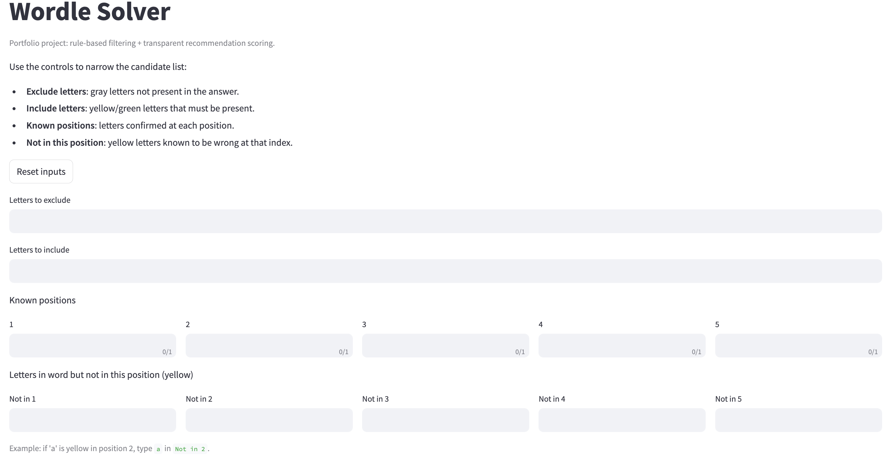
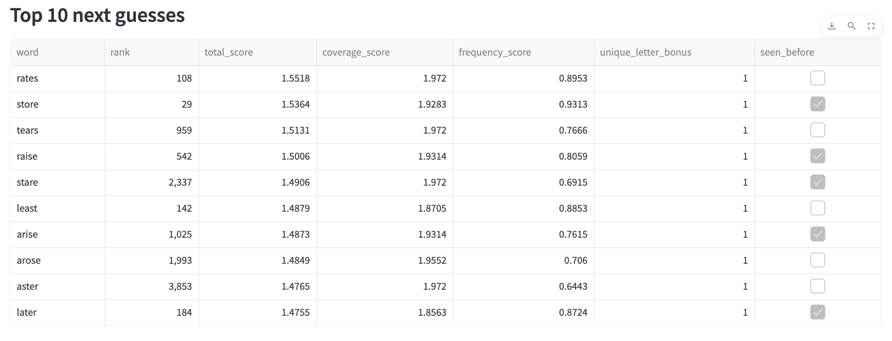
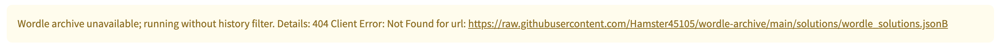

# Wordle Solver

A Streamlit app that helps solve daily Wordle puzzles by combining:
- rule-based candidate filtering from game feedback, and
- transparent scoring to rank the next best guesses.

## Problem

Wordle gives limited feedback each turn. The goal is to narrow the solution space quickly and choose high-information guesses.

## Data Sources

- Local word-frequency corpus: `unigram_freq.csv`
- Historical Wordle answers archive:
  - https://raw.githubusercontent.com/Hamster45105/wordle-archive/main/solutions/wordle_solutions.json
Thanks to https://github.com/Hamster45105 for this.

## Method

1. Keep only 5-letter words.
2. Apply constraints:
   - include letters (yellow/green),
   - exclude letters (gray),
   - fixed letter positions (green).
3. Score remaining words using:
   - `coverage_score`: weighted sum of unique-letter prevalence among remaining candidates,
   - `frequency_score`: normalized log word frequency from corpus,
   - `unique_letter_bonus`: favors diverse-letter guesses.
4. Combine into:
   - `total_score = 0.6 * coverage + 0.3 * frequency + 0.1 * unique_bonus`

The app shows top recommendations with component-level score transparency.

## Project Structure

- `app.py` - Streamlit UI
- `solver.py` - data loading, filtering, and scoring logic
- `tests/test_solver.py` - unit tests for core solver behavior

## Quickstart

```bash
python -m venv .venv
source .venv/bin/activate
pip install -r requirements.txt
streamlit run app.py
```

## Validation

The test suite checks:
- include/exclude filters,
- fixed-position filtering,
- repeated-letter constraints,
- fallback behavior when Wordle history cannot be fetched.

Run:

```bash
pytest -q
```

## Assumptions and Limitations

- Uses unigram frequency as a proxy for guess quality; this is not full entropy optimization.
- Exclusion logic assumes excluded letters are globally absent (does not yet model nuanced repeated-letter feedback from Wordle).
- Historical archive fetch is network-dependent; app continues gracefully when unavailable.

## Screenshots





## Live Demo

https://wordlesolver-ndbngsslxfz7nxxgvebgpp.streamlit.app/

